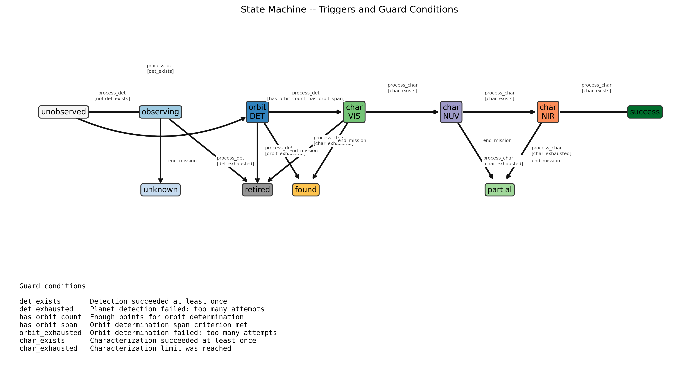
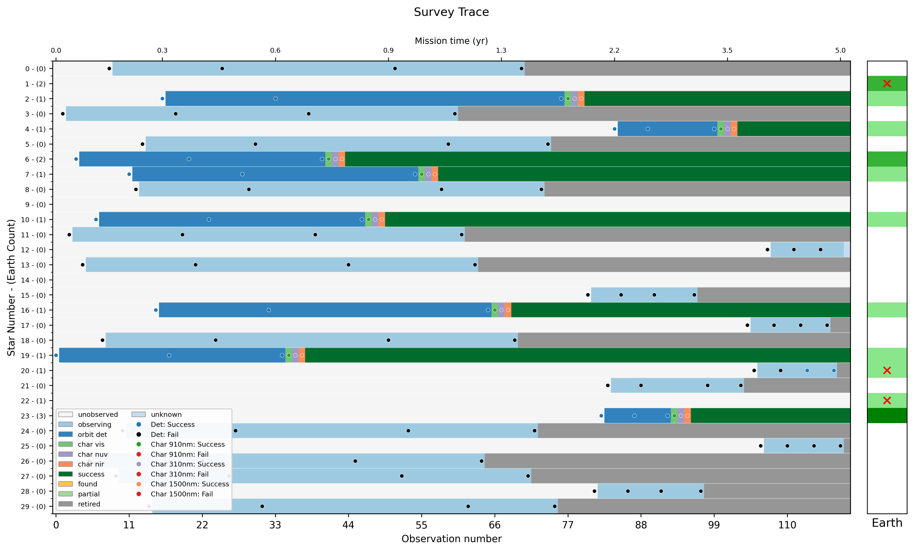
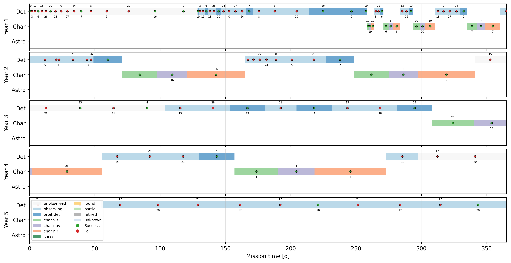
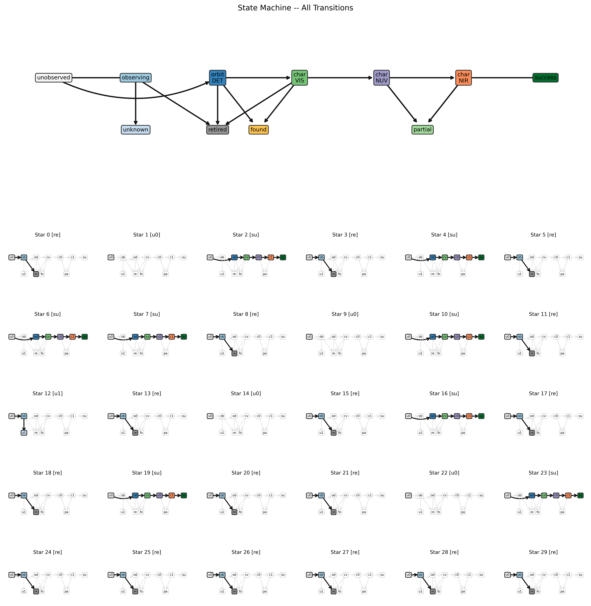

# Three-band Characterization scheduling

Output from the tag v0.4

It's a serial VIS/NUV/NIR characterization setup, with better
decomposition of states than the VIS-only setup.

Change from v0.3 -> v0.4: generic state-transition setup, 
not dependent on the number of char modes.

