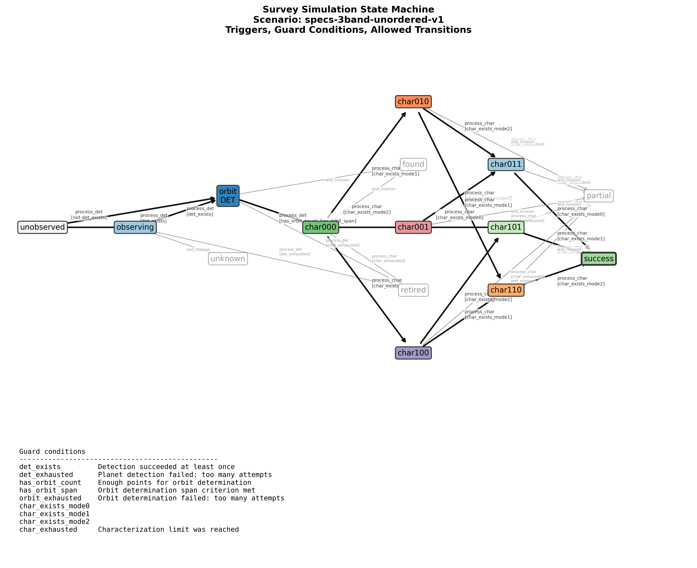
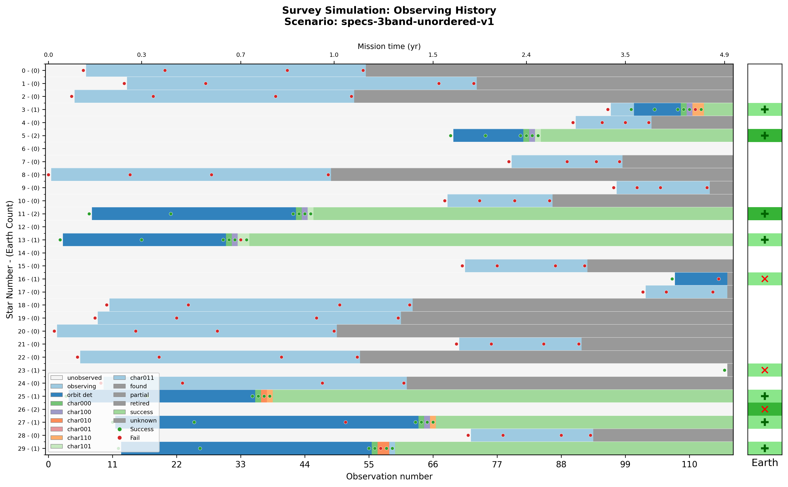
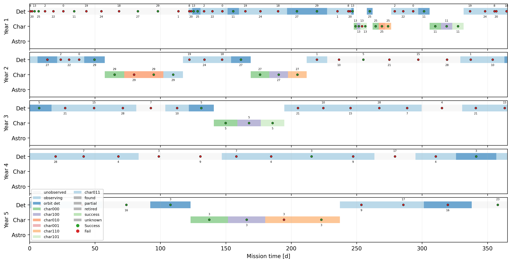
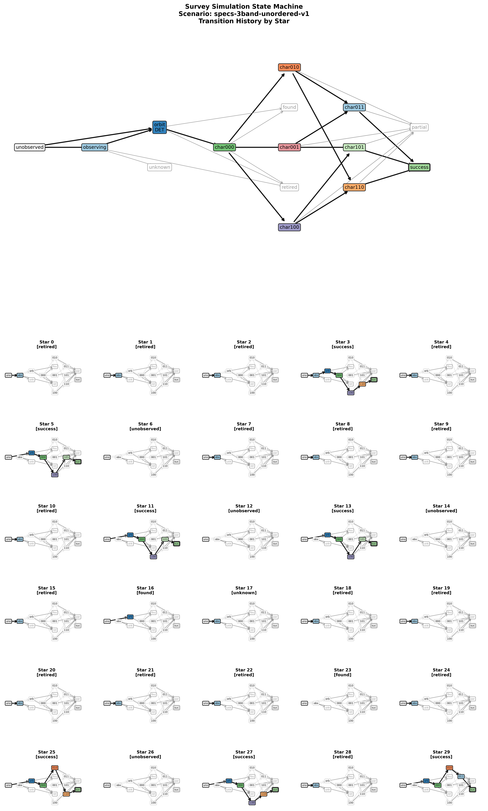

# Three serial characterizations: VIS, NUV, NIR

Script: [`Scripts/specs-3band-unordered-v1.json`](specs-3band-unordered-v1.json) | [`json5`](specs-3band-unordered-v1.json5)


Blind Search -> Orbit Characterization -> {VIS, NUV, NIR}

In contrast to regular 3-band, these chars can be done in any order

This first version uses a full decomposition of state space into
2^3 = 8 characterization states, counting each individual band's
characterization. The -v2 version uses 3 characterization states 
(counting just the number of successful characterization bands).

## Diagnostic Plots









## State Properties

```json
{
  "unobserved": {
    "mode": -1
  },
  "observing": {
    "mode": -1
  },
  "orbit_det": {
    "mode": -1
  },
  "char000": {
    "mode": [
      0,
      1,
      2
    ]
  },
  "char100": {
    "mode": [
      1,
      2
    ]
  },
  "char010": {
    "mode": [
      0,
      2
    ]
  },
  "char001": {
    "mode": [
      0,
      1
    ]
  },
  "char011": {
    "mode": 0
  },
  "char101": {
    "mode": 1
  },
  "char110": {
    "mode": 2
  },
  "found": {
    "terminal": true
  },
  "partial": {
    "terminal": true
  },
  "retired": {
    "terminal": true
  },
  "unknown": {
    "terminal": true
  },
  "success": {
    "success": 1
  }
}
```

## State Transitions

```json
[
  {
    "trigger": "process_det",
    "source": "unobserved",
    "dest": "observing",
    "unless": "det_exists"
  },
  {
    "trigger": "process_det",
    "source": "unobserved",
    "dest": "orbit_det",
    "conditions": "det_exists"
  },
  {
    "trigger": "process_det",
    "source": "observing",
    "dest": "orbit_det",
    "conditions": "det_exists"
  },
  {
    "trigger": "process_det",
    "source": "observing",
    "dest": "retired",
    "conditions": "det_exhausted",
    "after": "forget_star"
  },
  {
    "trigger": "process_det",
    "source": "orbit_det",
    "dest": "char000",
    "conditions": [
      "has_orbit_count",
      "has_orbit_span"
    ],
    "after": "promote_star"
  },
  {
    "trigger": "process_det",
    "source": "orbit_det",
    "dest": "retired",
    "conditions": "orbit_exhausted",
    "after": "forget_star"
  },
  {
    "trigger": "process_char",
    "source": "char000",
    "dest": "char100",
    "conditions": "char_exists_mode0"
  },
  {
    "trigger": "process_char",
    "source": "char000",
    "dest": "char010",
    "conditions": "char_exists_mode1"
  },
  {
    "trigger": "process_char",
    "source": "char000",
    "dest": "char001",
    "conditions": "char_exists_mode2"
  },
  {
    "trigger": "process_char",
    "source": "char000",
    "dest": "retired",
    "conditions": "char_exhausted",
    "after": "forget_star"
  },
  {
    "trigger": "process_char",
    "source": "char100",
    "dest": "char110",
    "conditions": "char_exists_mode1"
  },
  {
    "trigger": "process_char",
    "source": "char100",
    "dest": "char101",
    "conditions": "char_exists_mode2"
  },
  {
    "trigger": "process_char",
    "source": "char010",
    "dest": "char110",
    "conditions": "char_exists_mode0"
  },
  {
    "trigger": "process_char",
    "source": "char010",
    "dest": "char011",
    "conditions": "char_exists_mode2"
  },
  {
    "trigger": "process_char",
    "source": "char001",
    "dest": "char101",
    "conditions": "char_exists_mode0"
  },
  {
    "trigger": "process_char",
    "source": "char001",
    "dest": "char011",
    "conditions": "char_exists_mode1"
  },
  {
    "trigger": "process_char",
    "source": "char100",
    "dest": "partial",
    "conditions": "char_exhausted",
    "after": "forget_star"
  },
  {
    "trigger": "process_char",
    "source": "char010",
    "dest": "partial",
    "conditions": "char_exhausted",
    "after": "forget_star"
  },
  {
    "trigger": "process_char",
    "source": "char001",
    "dest": "partial",
    "conditions": "char_exhausted",
    "after": "forget_star"
  },
  {
    "trigger": "process_char",
    "source": "char011",
    "dest": "success",
    "conditions": "char_exists_mode0",
    "after": "forget_star"
  },
  {
    "trigger": "process_char",
    "source": "char101",
    "dest": "success",
    "conditions": "char_exists_mode1",
    "after": "forget_star"
  },
  {
    "trigger": "process_char",
    "source": "char110",
    "dest": "success",
    "conditions": "char_exists_mode2",
    "after": "forget_star"
  },
  {
    "trigger": "process_char",
    "source": "char011",
    "dest": "partial",
    "conditions": "char_exhausted",
    "after": "forget_star"
  },
  {
    "trigger": "process_char",
    "source": "char101",
    "dest": "partial",
    "conditions": "char_exhausted",
    "after": "forget_star"
  },
  {
    "trigger": "process_char",
    "source": "char110",
    "dest": "partial",
    "conditions": "char_exhausted",
    "after": "forget_star"
  },
  {
    "trigger": "end_mission",
    "source": [
      "char001",
      "char010",
      "char100",
      "char011",
      "char101",
      "char110"
    ],
    "dest": "partial"
  },
  {
    "trigger": "end_mission",
    "source": [
      "orbit_det",
      "char000"
    ],
    "dest": "found"
  },
  {
    "trigger": "end_mission",
    "source": "observing",
    "dest": "unknown"
  }
]
```
