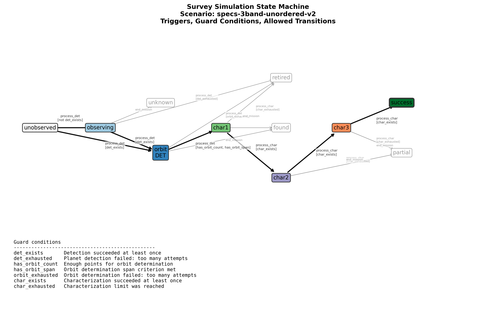
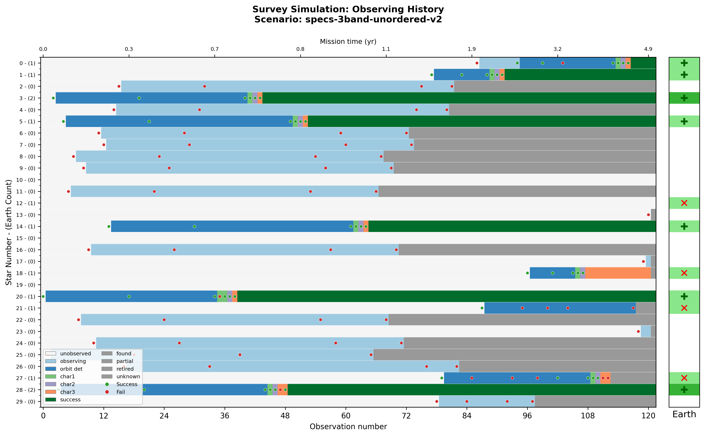
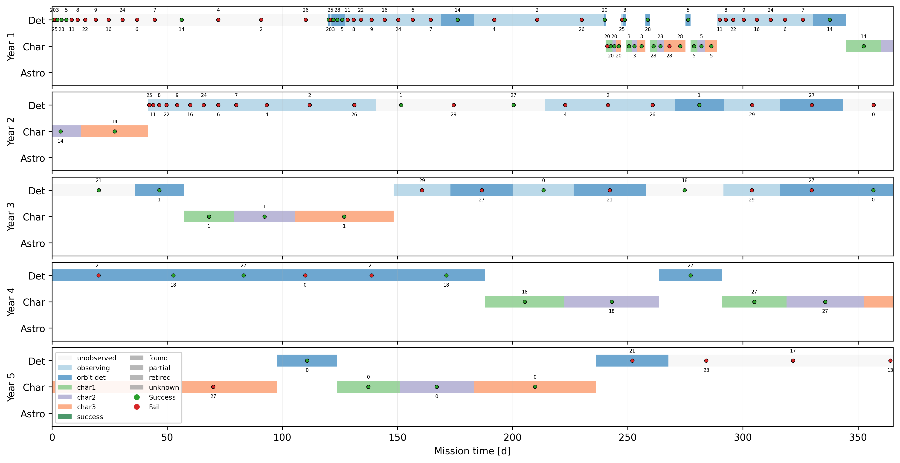
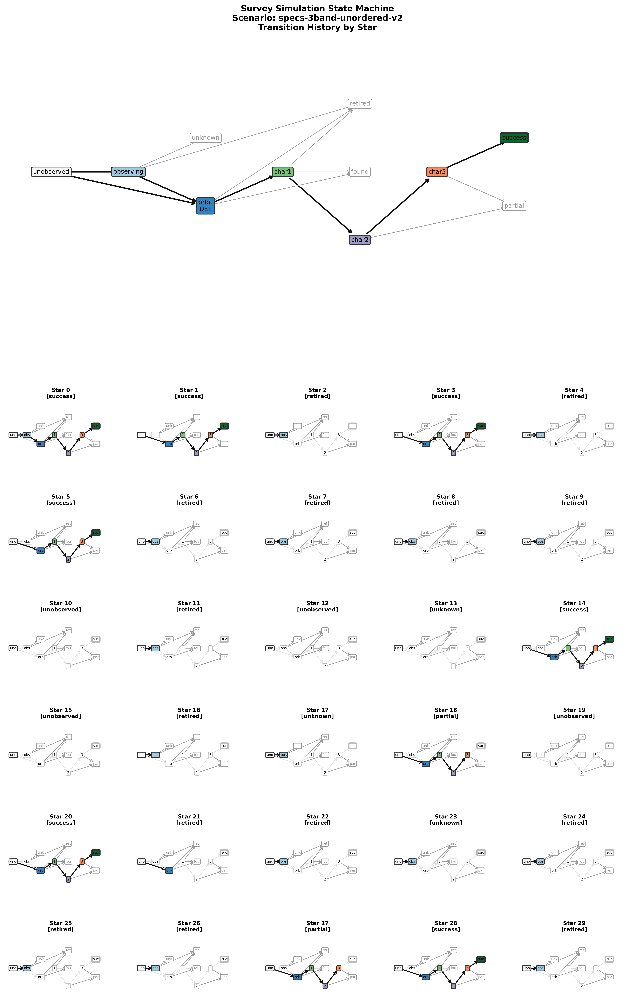

# Three serial characterizations: VIS, NUV, NIR

Script: [`Scripts/specs-3band-unordered-v2.json`](specs-3band-unordered-v2.json)


Blind Search -> Orbit Characterization -> {VIS, NUV, NIR}

Simpler implementation (-v2) that counts chars, rather than 
the other one (-v1) that has separate 
states for each band-by-band characterization that has been processed.

It illustrates that there's more than one way to encode an 
observing sequence into a state machine.

## Diagnostic Plots









## State Properties

```json
{
  "unobserved": {
    "mode": -1
  },
  "observing": {
    "mode": -1
  },
  "orbit_det": {
    "mode": -1
  },
  "char1": {
    "mode": [
      0,
      1,
      2
    ]
  },
  "char2": {
    "mode": [
      0,
      1,
      2
    ]
  },
  "char3": {
    "mode": [
      0,
      1,
      2
    ]
  },
  "found": {
    "terminal": true
  },
  "partial": {
    "terminal": true
  },
  "retired": {
    "terminal": true
  },
  "unknown": {
    "terminal": true
  },
  "success": {
    "success": 1
  }
}
```

## State Transitions

```json
[
  {
    "trigger": "process_det",
    "source": "unobserved",
    "dest": "observing",
    "unless": "det_exists"
  },
  {
    "trigger": "process_det",
    "source": "unobserved",
    "dest": "orbit_det",
    "conditions": "det_exists"
  },
  {
    "trigger": "process_det",
    "source": "observing",
    "dest": "orbit_det",
    "conditions": "det_exists"
  },
  {
    "trigger": "process_det",
    "source": "observing",
    "dest": "retired",
    "conditions": "det_exhausted",
    "after": "forget_star"
  },
  {
    "trigger": "process_det",
    "source": "orbit_det",
    "dest": "char1",
    "conditions": [
      "has_orbit_count",
      "has_orbit_span"
    ],
    "after": "promote_star"
  },
  {
    "trigger": "process_det",
    "source": "orbit_det",
    "dest": "retired",
    "conditions": "orbit_exhausted",
    "after": "forget_star"
  },
  {
    "trigger": "process_char",
    "source": "char1",
    "dest": "char2",
    "conditions": "char_exists"
  },
  {
    "trigger": "process_char",
    "source": "char1",
    "dest": "retired",
    "conditions": "char_exhausted",
    "after": "forget_star"
  },
  {
    "trigger": "process_char",
    "source": "char2",
    "dest": "char3",
    "conditions": "char_exists"
  },
  {
    "trigger": "process_char",
    "source": "char2",
    "dest": "partial",
    "conditions": "char_exhausted",
    "after": "forget_star"
  },
  {
    "trigger": "process_char",
    "source": "char3",
    "dest": "success",
    "conditions": "char_exists",
    "after": "forget_star"
  },
  {
    "trigger": "process_char",
    "source": "char3",
    "dest": "partial",
    "conditions": "char_exhausted",
    "after": "forget_star"
  },
  {
    "trigger": "end_mission",
    "source": [
      "char2",
      "char3"
    ],
    "dest": "partial"
  },
  {
    "trigger": "end_mission",
    "source": [
      "orbit_det",
      "char1"
    ],
    "dest": "found"
  },
  {
    "trigger": "end_mission",
    "source": "observing",
    "dest": "unknown"
  }
]
```
