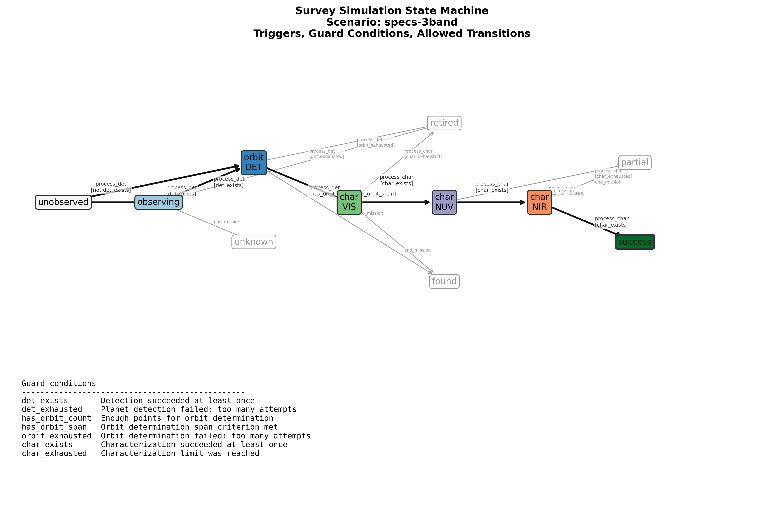
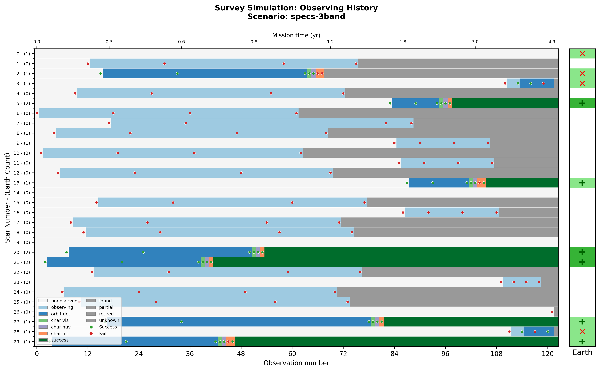
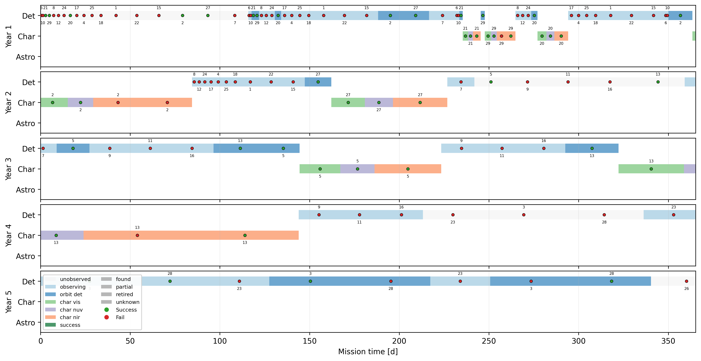
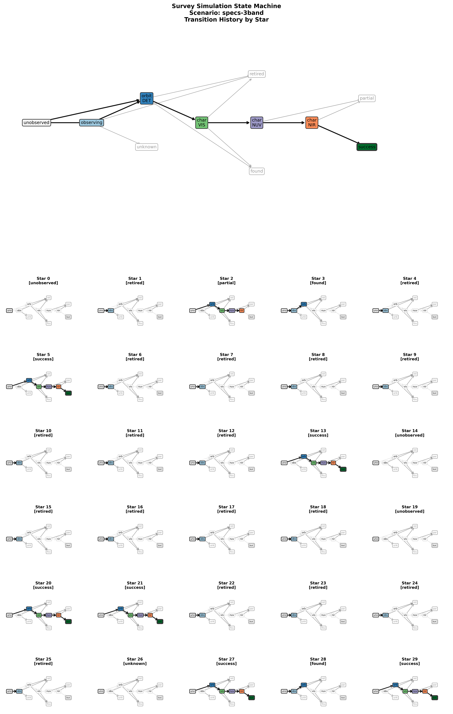

# Three serial characterizations: VIS, NUV, NIR

Script: [`Scripts/specs-3band.json`](specs-3band.json)


Blind Search -> Orbit Characterization -> VIS -> NUV -> NIR

Note that all characterizations are done serially, so VIS must be first.

## Diagnostic Plots









## State Properties

```json
{
  "unobserved": {
    "mode": -1
  },
  "observing": {
    "mode": -1
  },
  "orbit_det": {
    "mode": -1
  },
  "char_vis": {
    "mode": 0
  },
  "char_nuv": {
    "mode": 1
  },
  "char_nir": {
    "mode": 2
  },
  "found": {
    "terminal": true
  },
  "partial": {
    "terminal": true
  },
  "retired": {
    "terminal": true
  },
  "unknown": {
    "terminal": true
  },
  "success": {
    "success": 1
  }
}
```

## State Transitions

```json
[
  {
    "trigger": "process_det",
    "source": "unobserved",
    "dest": "observing",
    "unless": "det_exists"
  },
  {
    "trigger": "process_det",
    "source": "unobserved",
    "dest": "orbit_det",
    "conditions": "det_exists"
  },
  {
    "trigger": "process_det",
    "source": "observing",
    "dest": "orbit_det",
    "conditions": "det_exists"
  },
  {
    "trigger": "process_det",
    "source": "observing",
    "dest": "retired",
    "conditions": "det_exhausted",
    "after": "forget_star"
  },
  {
    "trigger": "process_det",
    "source": "orbit_det",
    "dest": "char_vis",
    "conditions": [
      "has_orbit_count",
      "has_orbit_span"
    ],
    "after": "promote_star"
  },
  {
    "trigger": "process_det",
    "source": "orbit_det",
    "dest": "retired",
    "conditions": "orbit_exhausted",
    "after": "forget_star"
  },
  {
    "trigger": "process_char",
    "source": "char_vis",
    "dest": "char_nuv",
    "conditions": "char_exists"
  },
  {
    "trigger": "process_char",
    "source": "char_vis",
    "dest": "retired",
    "conditions": "char_exhausted",
    "after": "forget_star"
  },
  {
    "trigger": "process_char",
    "source": "char_nuv",
    "dest": "char_nir",
    "conditions": "char_exists"
  },
  {
    "trigger": "process_char",
    "source": "char_nuv",
    "dest": "partial",
    "conditions": "char_exhausted",
    "after": "forget_star"
  },
  {
    "trigger": "process_char",
    "source": "char_nir",
    "dest": "success",
    "conditions": "char_exists",
    "after": "forget_star"
  },
  {
    "trigger": "process_char",
    "source": "char_nir",
    "dest": "partial",
    "conditions": "char_exhausted",
    "after": "forget_star"
  },
  {
    "trigger": "end_mission",
    "source": [
      "char_nuv",
      "char_nir"
    ],
    "dest": "partial"
  },
  {
    "trigger": "end_mission",
    "source": [
      "orbit_det",
      "char_vis"
    ],
    "dest": "found"
  },
  {
    "trigger": "end_mission",
    "source": "observing",
    "dest": "unknown"
  }
]
```
