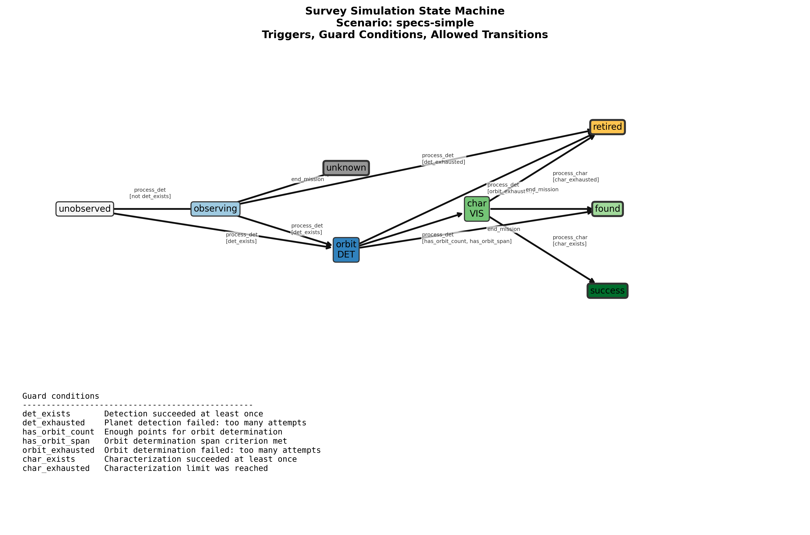
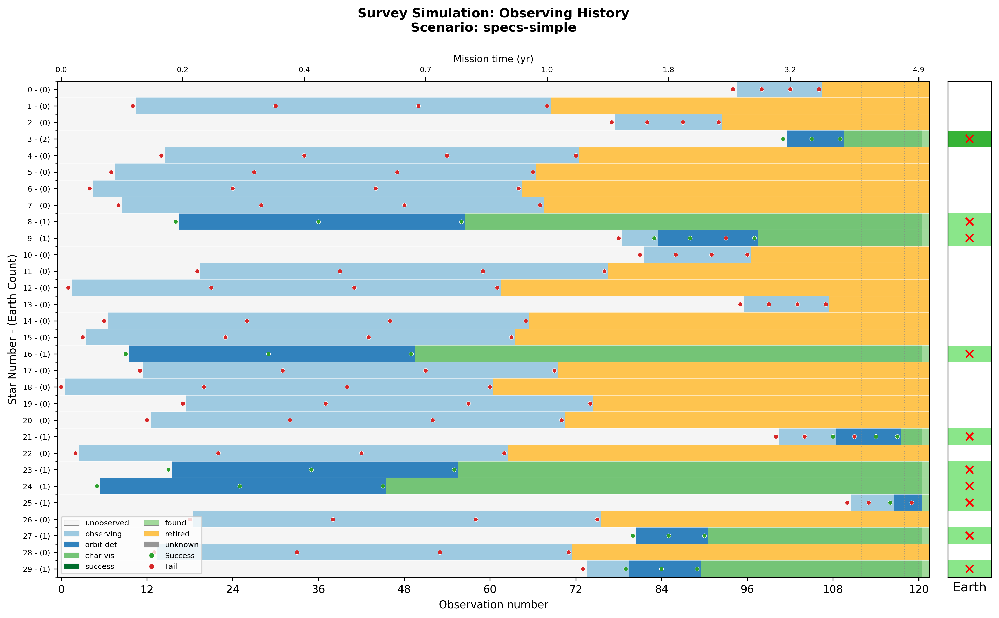
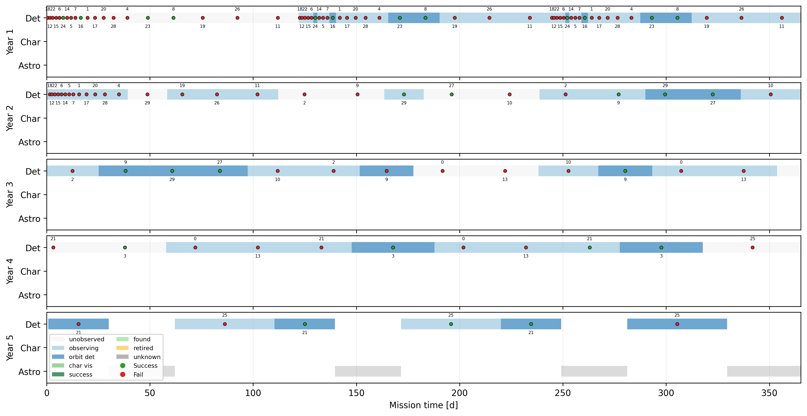
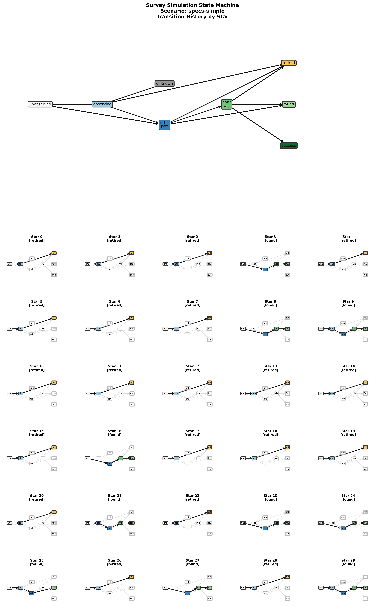

# Simple one-band characterization

Script: [`Scripts/specs-simple.json`](specs-simple.json) | [`json5`](specs-simple.json5)


Blind Search -> Orbit Characterization -> VIS-range Characterization

This is the simplest characterization concept (VIS-only),
but it still includes the blind search phase.

## Diagnostic Plots









## State Properties

```json
{}
```

## State Transitions

```json
[
  {
    "trigger": "process_det",
    "source": "unobserved",
    "dest": "observing",
    "unless": "det_exists"
  },
  {
    "trigger": "process_det",
    "source": "unobserved",
    "dest": "orbit_det",
    "conditions": "det_exists"
  },
  {
    "trigger": "process_det",
    "source": "observing",
    "dest": "orbit_det",
    "conditions": "det_exists"
  },
  {
    "trigger": "process_det",
    "source": "observing",
    "dest": "retired",
    "conditions": "det_exhausted",
    "after": "forget_star"
  },
  {
    "trigger": "process_det",
    "source": "orbit_det",
    "dest": "char_vis",
    "conditions": [
      "has_orbit_count",
      "has_orbit_span"
    ],
    "after": "promote_star"
  },
  {
    "trigger": "process_det",
    "source": "orbit_det",
    "dest": "retired",
    "conditions": "orbit_exhausted",
    "after": "forget_star"
  },
  {
    "trigger": "process_char",
    "source": "char_vis",
    "dest": "success",
    "conditions": "char_exists",
    "after": "forget_star"
  },
  {
    "trigger": "process_char",
    "source": "char_vis",
    "dest": "retired",
    "conditions": "char_exhausted",
    "after": "forget_star"
  },
  {
    "trigger": "end_mission",
    "source": [
      "orbit_det",
      "char_vis"
    ],
    "dest": "found"
  },
  {
    "trigger": "end_mission",
    "source": "observing",
    "dest": "unknown"
  }
]
```
