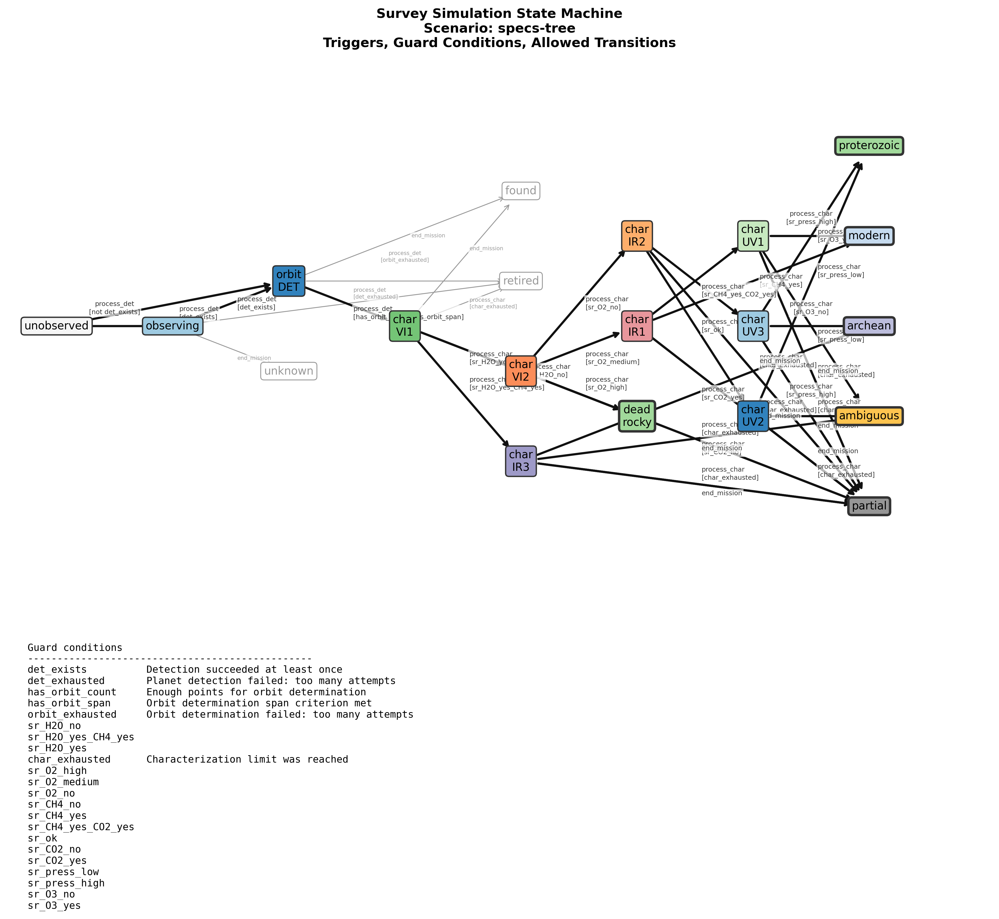
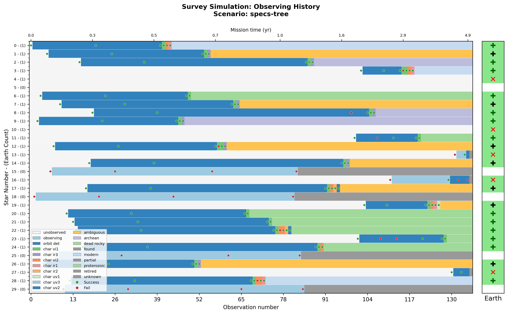
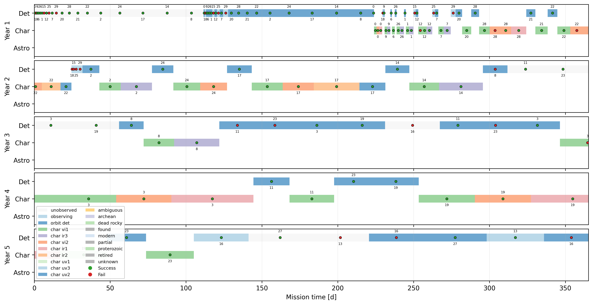
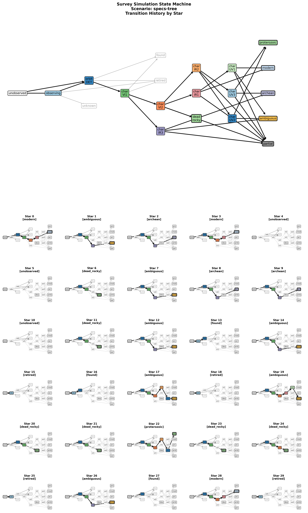

# Decision tree observing sequence -- Young et al.

Script: [`Scripts/specs-tree.json`](specs-tree.json) | [`json5`](specs-tree.json5)


This is a more complex observing sequence encoding a
simple decision tree with a depth of 2 to 3 characterizations.

State description:

|State Name| Measurement |Range  |Phys. QOI    |WL (nm) |
|--------- | ----------- | ----- | -------  | ------- |
|char_vi1  |  visw      | VIS   |  H20     |  900nm |
|char_vi2  |  viso      | VIS   |  O2      |  754nm |
|char_ir*  |  nir       | NIR   |  CH4/CO2 |  1650nm |
|char_uv*  |  nuv       | NUV   |  O3/Press|  250nm |
   
Notation:
* "State Name" is the finite state machine name, equivalent to
a node in the decision tree.
* "Measurement" is a shorthand for the measurement type, 
which is linked to the measurement physical QOI (quantity
of interest), a
wavelength range, and a specific retrieval algorithm.
* An algorithm uses specific parameters in "retrieval_models".
That is, three states (char_uv1/2/3) gather spectra around
250nm, and thereby estimate O3 and Pressure using
"retrieval_models['nuv']". The same
measurement is used at 3 places in the decision process.

## Diagnostic Plots









## State Properties

```json
{
  "unobserved": {
    "mode": -1
  },
  "observing": {
    "mode": -1
  },
  "orbit_det": {
    "mode": -1
  },
  "char_vi1": {
    "mode": 0
  },
  "char_vi2": {
    "mode": 1
  },
  "char_ir1": {
    "mode": 2
  },
  "char_ir2": {
    "mode": 2
  },
  "char_ir3": {
    "mode": 2
  },
  "char_uv1": {
    "mode": 3
  },
  "char_uv2": {
    "mode": 3
  },
  "char_uv3": {
    "mode": 3
  },
  "found": {
    "terminal": true
  },
  "retired": {
    "terminal": true
  },
  "unknown": {
    "terminal": true
  },
  "ambiguous": {
    "terminal": true,
    "success": -1
  },
  "partial": {
    "terminal": true,
    "success": -1
  },
  "archean": {
    "terminal": true,
    "success": 1
  },
  "dead_rocky": {
    "terminal": true,
    "success": 1
  },
  "modern": {
    "terminal": true,
    "success": 1
  },
  "proterozoic": {
    "terminal": true,
    "success": 1
  }
}
```

## State Transitions

```json
[
  {
    "trigger": "process_det",
    "source": "unobserved",
    "dest": "observing",
    "unless": "det_exists"
  },
  {
    "trigger": "process_det",
    "source": "unobserved",
    "dest": "orbit_det",
    "conditions": "det_exists"
  },
  {
    "trigger": "process_det",
    "source": "observing",
    "dest": "orbit_det",
    "conditions": "det_exists"
  },
  {
    "trigger": "process_det",
    "source": "observing",
    "dest": "retired",
    "conditions": "det_exhausted",
    "after": "forget_star"
  },
  {
    "trigger": "process_det",
    "source": "orbit_det",
    "dest": "char_vi1",
    "conditions": [
      "has_orbit_count",
      "has_orbit_span"
    ],
    "after": "promote_star"
  },
  {
    "trigger": "process_det",
    "source": "orbit_det",
    "dest": "retired",
    "conditions": "orbit_exhausted",
    "after": "forget_star"
  },
  {
    "trigger": "process_char",
    "source": "char_vi1",
    "dest": "dead_rocky",
    "conditions": "sr_H2O_no",
    "after": "forget_star"
  },
  {
    "trigger": "process_char",
    "source": "char_vi1",
    "dest": "char_ir3",
    "conditions": "sr_H2O_yes_CH4_yes"
  },
  {
    "trigger": "process_char",
    "source": "char_vi1",
    "dest": "char_vi2",
    "conditions": "sr_H2O_yes"
  },
  {
    "trigger": "process_char",
    "source": "char_vi1",
    "dest": "retired",
    "conditions": "char_exhausted",
    "after": "forget_star"
  },
  {
    "trigger": "process_char",
    "source": "char_vi2",
    "dest": "dead_rocky",
    "conditions": "sr_O2_high",
    "after": "forget_star"
  },
  {
    "trigger": "process_char",
    "source": "char_vi2",
    "dest": "char_ir1",
    "conditions": "sr_O2_medium"
  },
  {
    "trigger": "process_char",
    "source": "char_vi2",
    "dest": "char_ir2",
    "conditions": "sr_O2_no"
  },
  {
    "trigger": "process_char",
    "source": "char_vi2",
    "dest": "partial",
    "conditions": "char_exhausted",
    "after": "forget_star"
  },
  {
    "trigger": "process_char",
    "source": "char_ir1",
    "dest": "char_uv1",
    "conditions": "sr_CH4_no"
  },
  {
    "trigger": "process_char",
    "source": "char_ir1",
    "dest": "modern",
    "conditions": "sr_CH4_yes"
  },
  {
    "trigger": "process_char",
    "source": "char_ir1",
    "dest": "partial",
    "conditions": "char_exhausted",
    "after": "forget_star"
  },
  {
    "trigger": "process_char",
    "source": "char_ir2",
    "dest": "char_uv3",
    "conditions": "sr_CH4_yes_CO2_yes"
  },
  {
    "trigger": "process_char",
    "source": "char_ir2",
    "dest": "char_uv2",
    "conditions": "sr_ok"
  },
  {
    "trigger": "process_char",
    "source": "char_ir2",
    "dest": "partial",
    "conditions": "char_exhausted",
    "after": "forget_star"
  },
  {
    "trigger": "process_char",
    "source": "char_ir3",
    "dest": "ambiguous",
    "conditions": "sr_CO2_no",
    "after": "forget_star"
  },
  {
    "trigger": "process_char",
    "source": "char_ir3",
    "dest": "archean",
    "conditions": "sr_CO2_yes",
    "after": "forget_star"
  },
  {
    "trigger": "process_char",
    "source": "char_ir3",
    "dest": "partial",
    "conditions": "char_exhausted",
    "after": "forget_star"
  },
  {
    "trigger": "process_char",
    "source": "char_uv1",
    "dest": "ambiguous",
    "conditions": "sr_press_low",
    "after": "forget_star"
  },
  {
    "trigger": "process_char",
    "source": "char_uv1",
    "dest": "modern",
    "conditions": "sr_press_high",
    "after": "forget_star"
  },
  {
    "trigger": "process_char",
    "source": "char_uv1",
    "dest": "partial",
    "conditions": "char_exhausted",
    "after": "forget_star"
  },
  {
    "trigger": "process_char",
    "source": "char_uv2",
    "dest": "proterozoic",
    "conditions": "sr_press_low",
    "after": "forget_star"
  },
  {
    "trigger": "process_char",
    "source": "char_uv2",
    "dest": "ambiguous",
    "conditions": "sr_press_high",
    "after": "forget_star"
  },
  {
    "trigger": "process_char",
    "source": "char_uv2",
    "dest": "partial",
    "conditions": "char_exhausted",
    "after": "forget_star"
  },
  {
    "trigger": "process_char",
    "source": "char_uv3",
    "dest": "archean",
    "conditions": "sr_O3_no",
    "after": "forget_star"
  },
  {
    "trigger": "process_char",
    "source": "char_uv3",
    "dest": "proterozoic",
    "conditions": "sr_O3_yes",
    "after": "forget_star"
  },
  {
    "trigger": "process_char",
    "source": "char_uv3",
    "dest": "partial",
    "conditions": "char_exhausted",
    "after": "forget_star"
  },
  {
    "trigger": "end_mission",
    "source": [
      "char_vi2",
      "char_ir1",
      "char_ir2",
      "char_ir3",
      "char_uv1",
      "char_uv2",
      "char_uv3"
    ],
    "dest": "partial"
  },
  {
    "trigger": "end_mission",
    "source": [
      "orbit_det",
      "char_vi1"
    ],
    "dest": "found"
  },
  {
    "trigger": "end_mission",
    "source": "observing",
    "dest": "unknown"
  }
]
```
