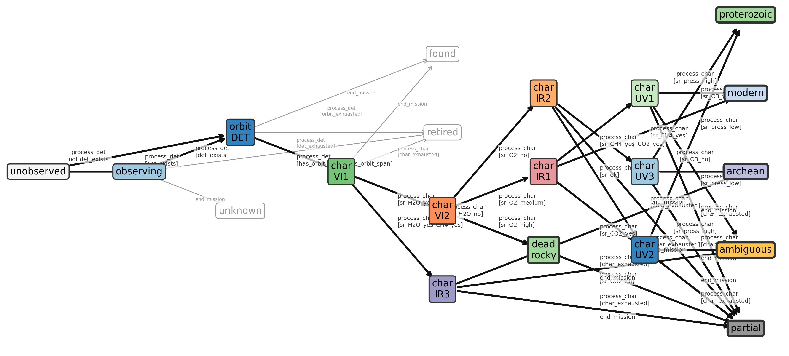

# EXOSIMS-Scheduler-Dev

Area for experiments in scheduler design for EXOSIMS.

Currently trying out state-transition or finite-state-machine approaches and thinking 
about whether they can be general enough to accommodate decision-tree-like 
observation choice.

For design information and some current development status, see `CLAUDE.md`.

Descriptive run artifacts (graphics) are present by tagged release in
[`Artifacts`](Artifacts).

(June 2026)

